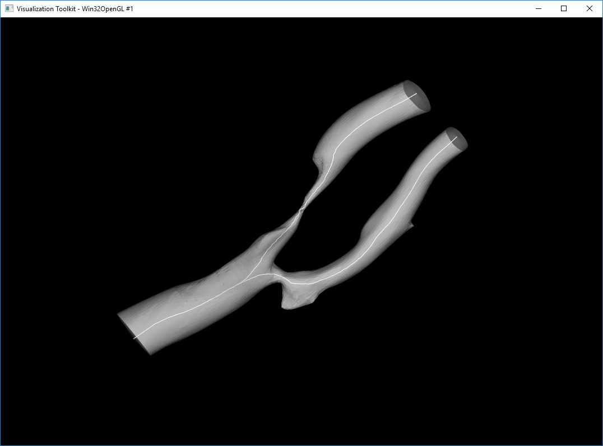

# Vessel-Centerline-Extraction
An interactive software to extract vessel centerline. The open end vessel will be enclosed in the process. Following parameters will be included in the output centerline vtp file:

- Abscissas
- Curvature
- Frenet system (Binomal, Normal, Tangent)
- Parallel Transport Normals
- Radius
- Torsion

## Usage
`CenterlineExtraction.exe <surface.stl> <capped_surface.stl> <centerline.vtp>`

 

## Interaction Keys:
`n` - New inlet/outlet point

`space` - locating the inlet/outlet point

`tab` - change inlet/outlet point type (red: inlet, green: outlet)

`enter` - process

Output data is in VTK polydata format(.vtp). You may open with [Paraview](https://www.paraview.org/).

## Build from Source
### Prerequisites
- [CMake](https://cmake.org/)
- [VTK](https://github.com/Kitware/VTK.git)
- [ITK](https://github.com/InsightSoftwareConsortium/ITK.git)
- [VMTK](https://github.com/vmtk/vmtk)
- [Qt](https://www.qt.io/)

### Compilation Procedure
- [Windows](./doc/build-en.md)
- [Ubuntu Developer Build](./doc/build-en.md)
- Ubuntu [\[Eng\]](./doc/build-ubuntu-en.md) [\[中\]](https://github.com/jackyko1991/Vessel-Centerline-Extraction/issues/2)

## Prebuild Binary
Prebuild binary for Windows can be downloaded [here](https://github.com/jackyko1991/Vessel-Centerline-Extraction/releases)

## GUI Version
GUI verion can be found in [this repository](https://github.com/jackyko1991/Vessel-Clipper).
