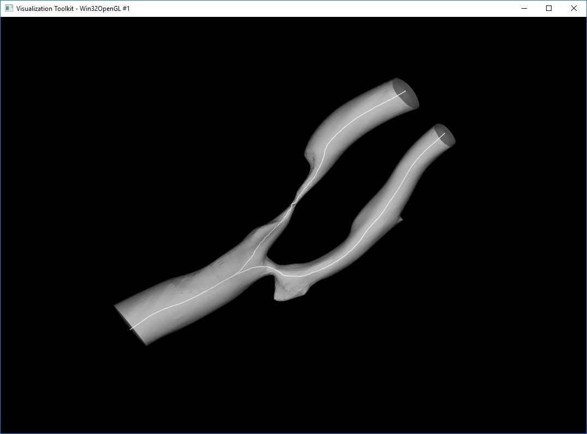

# Vessel Centerline Extraction

An interactive CLI tool to extract vessel centerlines from surface meshes. Open vessel ends are automatically capped during processing.

<p align="left">

</p>

[](https://github.com/jackyko1991/Vessel-Centerline-Extraction/actions/workflows/build.yml)

## Output Arrays

The output centerline `.vtp` file contains:

| Array | Description |
|-------|-------------|
| Abscissas | Arc-length along centerline |
| Curvature | Local curvature |
| FrenetBinormal / FrenetNormal / FrenetTangent | Frenet frame vectors |
| ParallelTransportNormals | Parallel transport frame |
| Radius | Inscribed sphere radius (vessel lumen radius) |
| Torsion | Local torsion |

## Usage

```bash
CenterlineExtraction <surface.stl> <capped_surface.stl> <centerline.vtp>
```

Output is in VTK PolyData format (`.vtp`). Open with [ParaView](https://www.paraview.org/).

## Interaction Keys

| Key | Action |
|-----|--------|
| `n` | Add new inlet/outlet seed point |
| `Space` | Place seed at cursor position |
| `Tab` | Toggle seed type (red = inlet, green = outlet) |
| `Enter` | Compute centerline |

## Build from Source

### Prerequisites

Install [pixi](https://pixi.sh):

```bash
curl -fsSL https://pixi.sh/install.sh | bash
```

### Build

```bash
git clone https://github.com/jackyko1991/Vessel-Centerline-Extraction
cd Vessel-Centerline-Extraction
bash scripts/build.sh
```

The script will:
1. Install VTK 9, ITK, CMake and Ninja via pixi (conda-forge) — no system installs needed
2. Build VMTK from source into `build/vmtk-install/` (~20–40 min on first run, skipped if cached)
3. Configure and compile `CenterlineExtraction`
4. Run unit tests against the bundled test data

### Platforms

| Platform | Status |
|----------|--------|
| macOS Apple Silicon (arm64) | Supported |
| macOS Intel (x86_64) | Supported |
| Linux (x86_64) | Supported (CI tested) |
| Windows (x86_64) | Supported |

On Windows, run `scripts\build.bat` from a Command Prompt instead. VMTK is installed automatically as a prebuilt conda-forge package — no source build required.

## GUI Version

A Qt-based GUI version is available at [Vessel-Clipper](https://github.com/jackyko1991/Vessel-Clipper).
