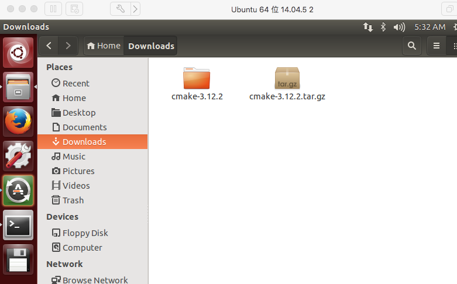
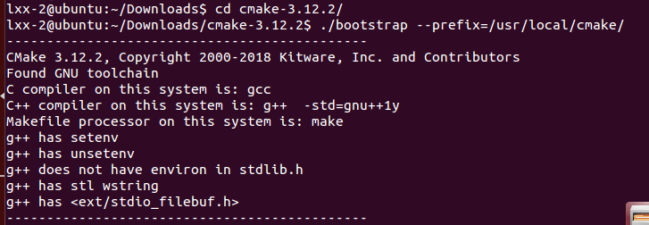
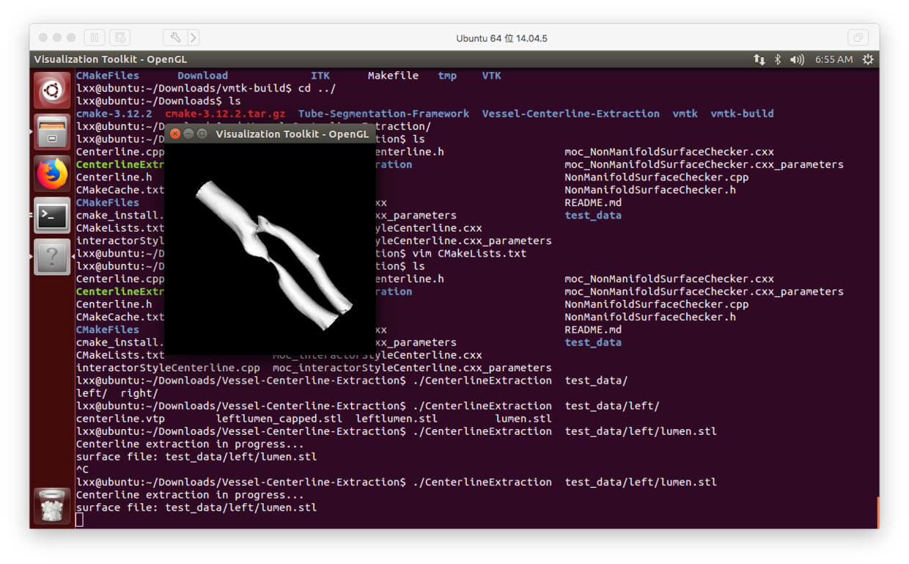

# Ubuntu Source build (non-developer)
This compilation is for non-developer usage. For developers, please follow the build instruction [here]().

## Prerequisites
Please install the following packages.
- Git
	```console
	sudo apt-get install libcurl4-gnutls-dev libexpat1-dev gettext libz-dev libssl-dev
	sudo apt-get install git
	```
- G++
	```Console
	sudo apt install build-essential
	sudo apt-get install g++
	```
- [CMake](https://cmake.org/)
	1. Download binary package from official site and unzip
	
	2. Configure the latest CMake as system cmake. Open terminal at the unzipped cmake directory and run the command:
	```console
	./bootstrap --prefix=/usr/local/cmake/
	make
	sudo make install
	```
	

	3. Add cmake to environment variable
	```console
	sudo vim /etc/profile
	```

	4. Insert following lines to the back of /etc/profile
	```
	export PATH=$PATH:/usr/local/cmake/bin
	```

	5. Press `Esc` then `!wq` to save and quit from vim
	6. Refresh system path and check if cmake version is same as the downloaded binary
	```console
	source /etc/profile
	cmake --version
	```
- Python
	For convenience we use python 2.7 as an example, you may choose python 3 or Anaconda upon your perference
	```console
	sudo apt-get install python-dev libqt4-dev
	sudo mkdir /usr/lib/python2.7/config/
	sudo cp /usr/lib/python2.7/config-x86_64-linux-gnu/libpython2.7.so /usr/lib/python2.7/config/libpython2.7.so
	```
- [VMTK](https://github.com/vmtk/vmtk)
	```Console
	sudo apt-get install git
	cd ~/Downloads
	git clone https://github.com/vmtk/vmtk.git
	sudo apt-get install libxt-dev libgl1-mesa-glx libgl1-mesa-dev libglapi-mesa libosmesa-dev build-essential
	mkdir vmtk-build
	cd vmtk-build
	cmake ../vmtk -DPYTHON_INCLUDE_DIR=/usr/include/python2.7 -DPYTHON_LIBRARY=/usr/lib/python2.7/config/libpython2.7.so 
	make -j2  #May take quite a long time,-j2 stands for number of threads to build
	```

## Compile the Program
```Console
cd ~/Downloads
git clone https://github.com/jackyko1991/Vessel-Centerline-Extraction.git
cd Vessel-Centerline-Extraction
vim CMakeList.txt
```

1. Press `i` to edit thee red lines as following:
	

2. Please note that `lxx` differs from computers. Replace it with your username.
3. After editing the CMakeList, press `Esc` then `!wq` to save and quit from vim
4. Final Step
	```Console
	cmake .
	make
	./CenterlineExtraction  test_data/left/lumen.stl
	```
5. Done!!!
	